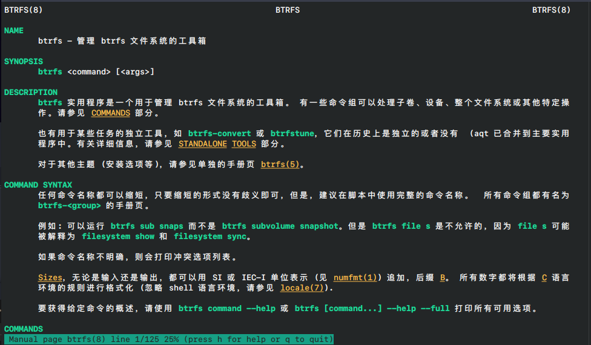

# man 手册页中文版

该手册页是 [manpages-l10n](https://salsa.debian.org/manpages-l10n-team/manpages-l10n) 的特别为 `archlinux` 构建的中文翻译。制作该翻译的目的主要是为了个人学习。

请注意：该翻译和 [rust-library-chinese](https://github.com/wtklbm/rust-library-i18n) 一样，是由机器翻译自动生成的，没有任何形式的保证，使用该仓库提供的内容，则表示您需自行承担使用该翻译所带来的所有风险。

理论上，该文档可以在 Linux 和 macOS 上使用，如果您希望在 macOS 上使用，要注意的是，文档中的内容可能和 macOS 系统自带的命令使用方式有所差异，您需要自行识别此差异，除非您使用 GNU 命令行工具来缩小此差异，作为参考，您可以查看 [coreutils](https://formulae.brew.sh/formula/coreutils)，或者您可以在搜索引擎中搜索 "macOS 安装 GNU 命令行工具" 相关字样。

# 截图



# 使用方式

中文文档是按英文文档的格式来逐步翻译的，但因操作系统的不同，翻译好的文档可能和本机上的英文文档有所差别，因此，不建议您直接将其放在 `MANPATH` 环境变量中供 `man` 命令识别。而是通过创建 `alias` 的方式，按需灵活的阅读中文文档。

```bash
# 中文翻译的源代码放在了当前项目下的 `dist` 文件夹中
git clone https://github.com/wtklbm/manpages-chinese
cd manpages-chinese/dist
mkdir -p ~/.local/share/man/zh-CN

# 这里改个名字是为了防止 `MANPATH` 环境变量直接识别中文文档
cp -r ./zh_CN/* ~/.local/share/man/zh-CN

# 创建 alias，将下面的代码放在特定的文件中
# 如果您在使用 bash，请将下面的代码添加到 `~/.bashrc` 中
# 如果您在使用 zsh，请将下面的代码添加到 `~/.zshrc` 中
# `mane` 是一个 alias 名，您可以修改成您喜欢的名称
alias mane="man -M ~/.local/share/man/zh-CN"

# 重启您的终端
# 此时，如果您想查看 `btrfs` 的文档，请输入:
mane btrfs

# 愉快的编码
```

# LICENSE

GPL-3.0
